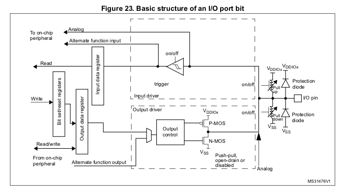

# Notes

Input and output in embedded system is not really about human - a lot of time the microcontroller works without any input from human. They care more about the world around viewed by the peripheral

Peripherals have many varieties:

- Different speed - some are run very frequently like rocker laser range finder that run hundreds of times per second, and on the other hand we have temperature measurer that run like once every five seconds
- Access type: sequential where time matter for the data, or random where we just pick a bunch of data from memory

Software have certain operations on IO devices:

- Get and set parameter - think of flag or option
- Receive and transmit data
- Enable and disable function - think of turning the peripheral on or off

Two ways to interface software and hardware

- Special instruction on x86 `in` and `out`. Write to specialized area that will in turn talk to hardware. Terrible because unclear what in/out meant to the hardware. Terrible to debug because no idea what went wrong - what does in/out do to memory, what changed, etc.; also the support required to do all this: we need specialized compilers to use the instruction that are specific to hardware
- Treat devices like memory - the way to go

When we treat device like memory, it means "trigger" for hardware and normal RAM are in same address space. We can write to those trigger address the same way you write to normal RAM: `memcpy` will work, `memset` will work, etc. For example, if you write to `0x07cd` it's just a normal RAM and will do normal RAM thing, whereas if you write to `0x65ab` it will enable the LED, or if you read `0x23ef` you are reading data from the button

Which memory addresses are used for normal RAM and which addresses are used for hardware is determined by the manufacturer of the microcontroller and are **hardwired** into the chip - meaning we cannot change this with software

The mapping is very fast and no lookup is needed. In fact, because the address mapped to hardware is wired directly to the hardware, when you write/read to those address you basically write/read the hardware. This also allowed simpler memory protection mechanism: the hardware has control over the mapped region and can do by itself memory protection like lock the region while the device is running

**Caution**: read and write to Memory mapped IO (MMIO) is not the same as normal region. You can do a read of a region and this read operation can perform some unexpected instructions like reset certain register on hardware or reset some flags. This "weird" way of doing things are done to save instruction and increase execution speed

Memory management unit (MMU) is special computer unit that are used to deal specifically with memory. Normally doing `memcpy` take times and processor has to wait for this before doing another instruction - using MMU we can delegate those tasks to it and go to different instruction. When operation done it will let us know

## GPIO

Each GPIO pin represents one bit in memory: if the pin is on it’s a 1, off it’s a 0. Can be used to:

- Check if a wire is on or off
- Check if device is on or off
- Turn device on/off
- Interrupt the CPU to tell it a button was pressed
- etc.

The I/O pin head toward the outside world, i.e to the peripheral. Some interesting parts on the structure:

- The protection diode prevent high charge from going directly to the processor and fry it. Basically stop damage from static charge
- Pull up and pull down
- The on/off triangle is call [Schmitt trigger](https://en.wikipedia.org/wiki/Schmitt_trigger) and this is used to detect whether a signal considered to be 0 or 1
- Pullup/pulldown is used to set the default output signal: if we don't set the signal ourselves, the default value for the output should be high/low

## Side talk

Bluetooth is a weird protocol. You phone emit bluetooth signal many times a second, and you can use the signal to determine which phone is which. 

When you try to pair up with a device using Bluetooth, you basically send out your secret key everywhere - hence you don't want to pair out in public. This secret key is used to pair up with device. See [How does Bluetooth pairing work?](https://stackoverflow.com/questions/27360338/how-does-bluetooth-pairing-work) and [Sparkfun Bluetooth basic](https://learn.sparkfun.com/tutorials/bluetooth-basics/how-bluetooth-works)

Why computer slow down when it's heated up? The answer is "it's complicated". Some say because high temp reduce the clock cycle of the crystal that is used to keep track of time

When having a computer, no air is actually worse than some air because air acts as insulator - in vacuum environment electric can jump directly through space